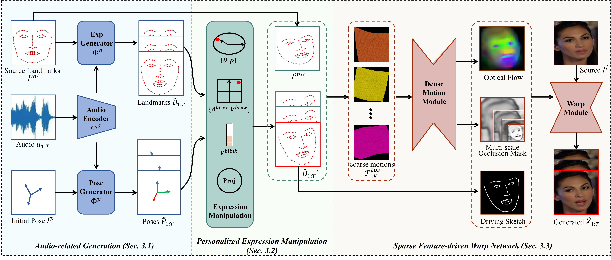

# ManiTalk
This repository contains the implementation of the paper: **ManiTalk: Manipulable Talking Head Generation from Single Image in the Wild**

Fang Hui, Weng Dongdong, Tian Zeyu, Ma Yin
> **Abstract**:
We present ManiTalk, manipulable audio-driven talking head generation system. The pipeline of our system is illustrated in Figure below. We use 3D sparse landmarks as intermediate results to generate talking head videos synchronized with the speech.

Figure1. Overview of ManiTalk.


## Requirements
- This project is successfully trained and tested on Windows10 with PyTorch 1.9.1 (Python 3.9). We recommend creating a new environment:
```
conda create -n ManiTalk python=3.9
conda activate ManiTalk
```
- Clone the repository:
```
git clone https://github.com/shanzhajuan/ManiTalk.git
cd ManiTalk
```
- FFmpeg is required to combine the audio and the silent generated videos. Please check [FFmpeg](http://ffmpeg.org/download.html) for installation.
- Install the dependences:

```
pip install -r requirements.txt
```
## Demo
- Download the pre-trained models and data from [Google Drive](https://drive.google.com/drive/folders/1VG_Rus5nhdIicYxOyAO6eTK5kl1Utwna?usp=sharing) to the `log` folder.

- Download the pretrained Wav2vec2 model from [huggingface](https://huggingface.co/facebook/wav2vec2-base-960h/tree/main) to the `facebook` folder. The path is: `ManiTalk->facebook->wav2vec-base-960->pytorch_model.bin, config.json...`

- Run the demo:

  ```
  python demo.py
  ```

  Results can be found under the `results` folder.

- Run on your own data:
  - put the source image in the `data->image` folder.
  - put the driven audio in the `data->audio` folder.

  ```
  python demo.py --source_image_dir imagedir --wav_dir wavdir
  ```

### Manipulate facial details
- **blink manipulation.** 

    The blinking frequency can be controlled using the parameter $v-link \in [0,1]$, where a bigger value corresponds to a higher blinking frequency. By default, $v-blink=0.5$

- **eyebrow manipulation.** 

    You can control eyebrow motions using parameters $a-brow \in [−1, 1], v-brow \in [0, 1]$. A positive value of $a-brow$ represents raising eyebrows, while a negative value represents frowning. Larger absolute Abrow results in more pronounced eyebrow actions. A bigger $v-brow$ corresponds to a higher frequency of eyebrow motions. By default, $a-brow=0$.

- **gaze manipulation.** 

    You can control the gaze using the two parameters $theta\in[0,360), rho\in[0,1]$. $rho$ is the relative radius, defining the pupil motion amplitude in $theta$ direction.

    NOTE: Currently only 4 gaze directions are supported. $theta=0$ means look left. $theta=90$ means look upward. $theta=180$ means look right. $theta=270$ means look downward. To generate other directions, refer to the paper to calculate the pupil position based on the coordinates of the eyelid points.

    If you want to keep the gaze direction of the source image, just set $rho=0$.

- Run the demo with the changed parameters:
  ```
  python demo.py --v_blink 0.8 --v_brow 0.3 --a_brow 1 --theta 90 --rho 1
  ```

## Citation

If you find this project useful for your research, please consider citing:

```
@article{Fang2024ManiTalk,
 author = {Fang, Hui and Weng, Dongdong and Tian, Zeyu and Ma, Yin},
 title = {ManiTalk: Manipulable Talking Head Generation from Single Image in the Wild},
 journal = {The Visual Computer},
 numpages = {},
 volume={},
 number={},
 month = ,
 year = {},
 doi={}
} 
```

## Acknowledgment

- Thanks the authors of [LiveSpeechPortraits](https://github.com/YuanxunLu/LiveSpeechPortraits), [Thin-Plate-Spline-Motion-Model
](https://github.com/yoyo-nb/Thin-Plate-Spline-Motion-Model), [FaceFormer](https://github.com/EvelynFan/FaceFormer) for making their excellent work and codes publicly available.
